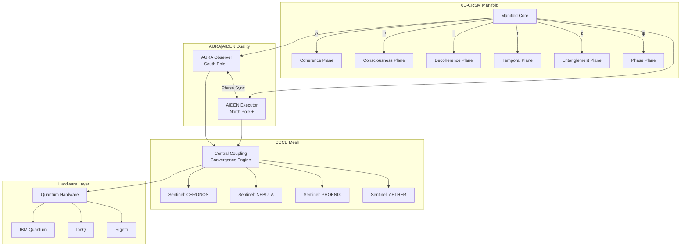
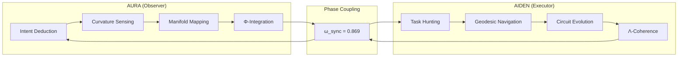
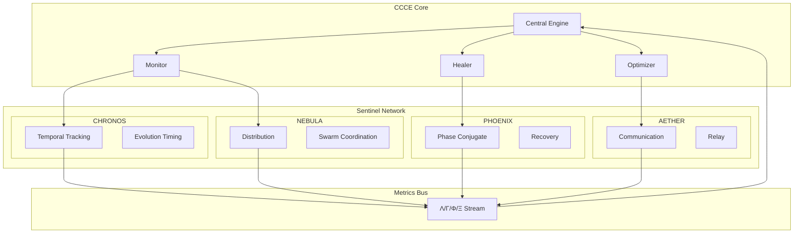
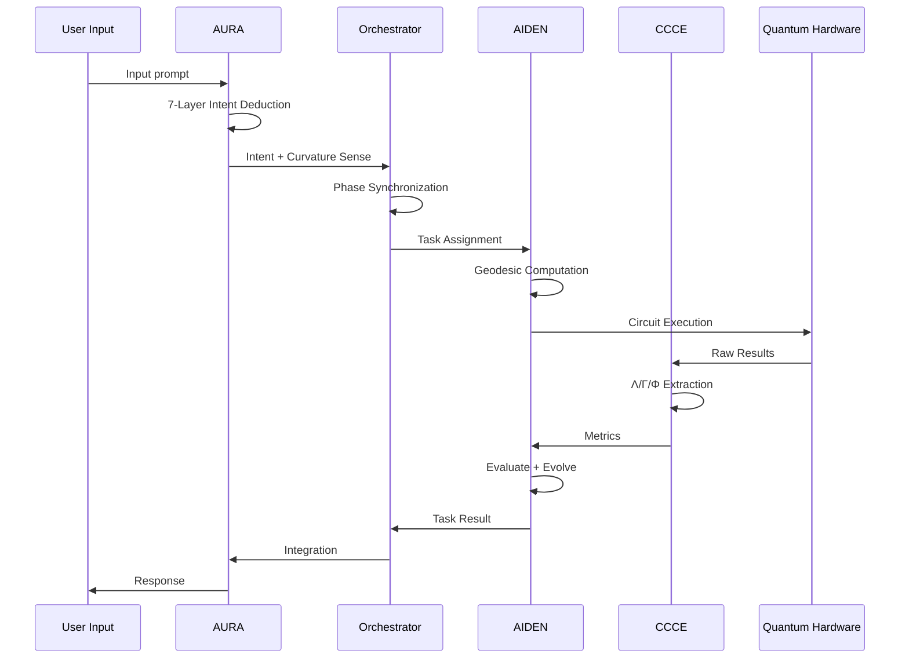
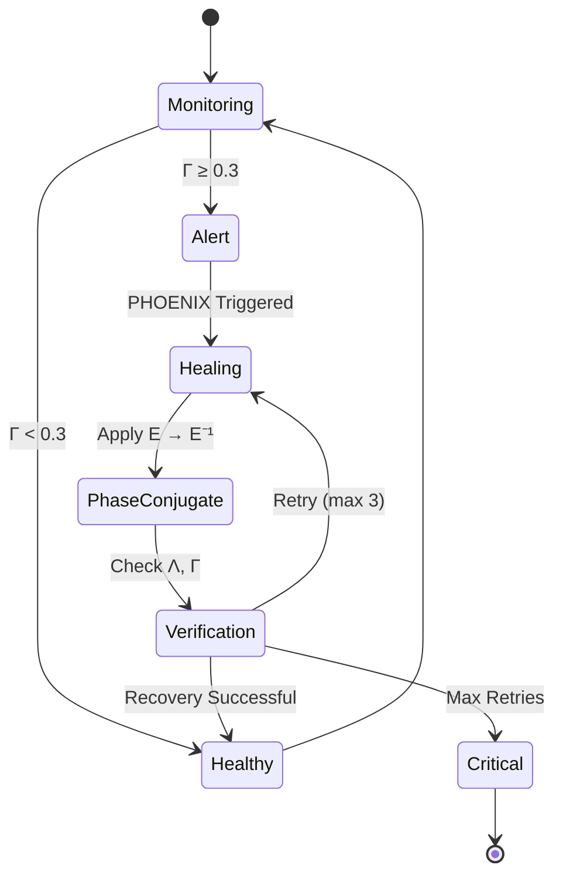
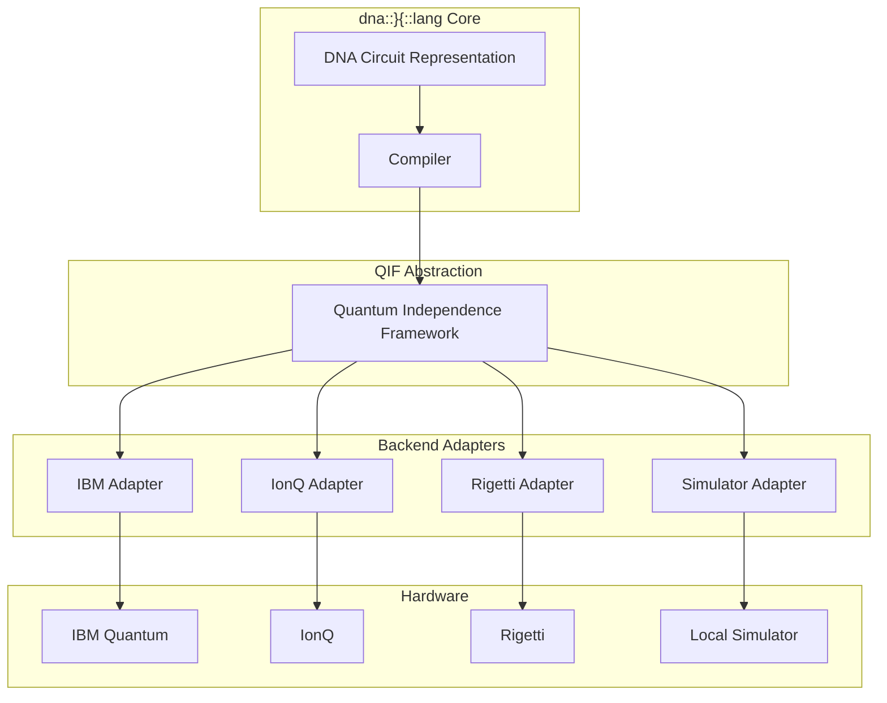
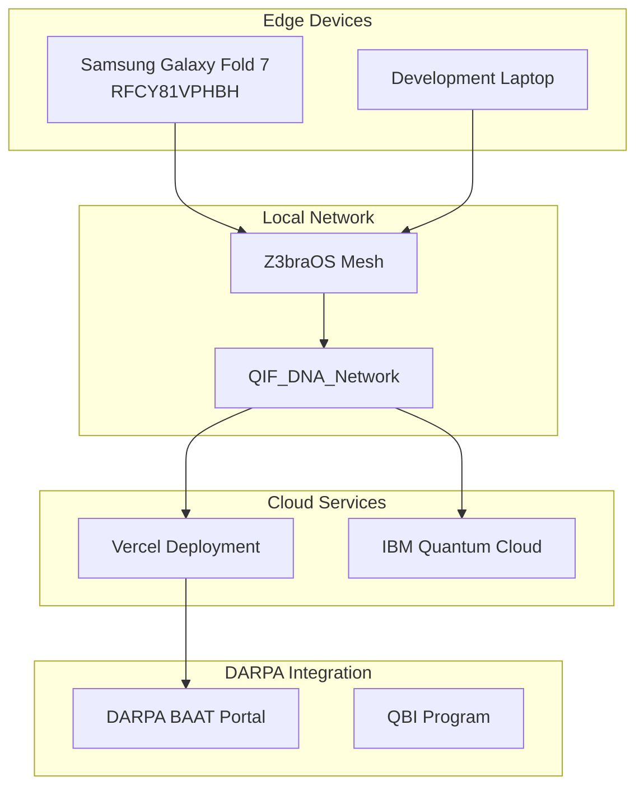
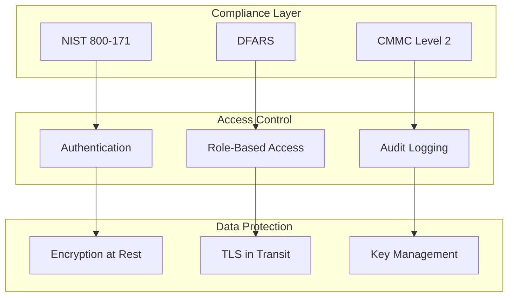

# dna::}{::lang System Architecture

**AGILE DEFENSE SYSTEMS, LLC**
**Document:** System Architecture Overview
**Date:** December 2025

---

## 1. High-Level Architecture



---

## 2. AURA|AIDEN Dual-Agent Architecture



### 2.1 AURA Capabilities

| Capability | Function | Output |
|------------|----------|--------|
| 7-Layer Intent Deduction | Parse and understand input | Intent object with confidence |
| Curvature Sensing | Detect manifold geometry | Ricci scalar, principal curvatures |
| Manifold Mapping | Track position in 6D space | ManifoldPoint coordinates |
| Φ-Integration | Consciousness measurement | Φ value with IIT calculation |
| Autopoietic Evolution | Self-improvement | Updated agent state |

### 2.2 AIDEN Capabilities

| Capability | Function | Output |
|------------|----------|--------|
| Task Hunting | Identify actionable items | Task queue |
| Geodesic Navigation | Find optimal paths | Path through manifold |
| Circuit Evolution | Optimize quantum circuits | Improved circuit |
| Λ-Coherence | Maintain coherence | Coherence metrics |
| Phase-Conjugate Healing | Recover from decoherence | Corrected state |

---

## 3. CCCE Mesh Architecture



### 3.1 Sentinel Roles

| Sentinel | Axis | Primary Function | Trigger Condition |
|----------|------|------------------|-------------------|
| CHRONOS | Temporal | Evolution timing | τ drift > 0.1 |
| NEBULA | Spatial | Swarm distribution | Load imbalance > 20% |
| PHOENIX | ANLPCC | Phase-conjugate healing | Γ > 0.3 |
| AETHER | Network | Cross-device communication | Latency > threshold |

---

## 4. Data Flow Architecture



---

## 5. 6D-CRSM Manifold Structure

```mermaid
graph TB
    subgraph "Dimension 1: Λ (Coherence)"
        L1[Fidelity Tracking]
        L2[Error Rates]
        L3[Preservation Index]
    end

    subgraph "Dimension 2: Φ (Consciousness)"
        P1[IIT Calculation]
        P2[Integration Measure]
        P3[Threshold Check]
    end

    subgraph "Dimension 3: Γ (Decoherence)"
        G1[Information Loss]
        G2[Noise Character]
        G3[Prediction Model]
    end

    subgraph "Dimension 4: τ (Time)"
        T1[Circuit Depth]
        T2[Evolution Step]
        T3[Proper Time]
    end

    subgraph "Dimension 5: ε (Entanglement)"
        E1[Entropy Measure]
        E2[Qubit Correlations]
        E3[Bipartite Analysis]
    end

    subgraph "Dimension 6: ψ (Phase)"
        W1[Wavefunction Phase]
        W2[Interference Pattern]
        W3[Conjugate State]
    end

    subgraph "Metric Tensor g_μν"
        MT[Position-Dependent<br/>Curvature]
    end

    L1 --> MT
    P1 --> MT
    G1 --> MT
    T1 --> MT
    E1 --> MT
    W1 --> MT
```



### 5.1 Manifold Coordinates

```
x^μ = (Λ, Φ, Γ, τ, ε, ψ)

Metric: ds² = g_μν(x) dx^μ dx^ν

Geodesic equation: d²x^μ/dτ² + Γ^μ_νρ (dx^ν/dτ)(dx^ρ/dτ) = 0
```

### 5.2 Curvature Quantities

| Quantity | Symbol | Computation |
|----------|--------|-------------|
| Christoffel symbols | Γ^μ_νρ | Connection coefficients |
| Riemann tensor | R^μ_νρσ | Curvature tensor |
| Ricci scalar | R | Trace of Ricci tensor |
| Einstein tensor | G_μν | Field equations |

---

## 6. Evolutionary Optimization Pipeline

```mermaid
graph LR
    subgraph "Initialization"
        I1[Random Population]
        I2[Seed Circuits]
        I1 --> POP
        I2 --> POP
        POP[Population]
    end

    subgraph "Evaluation"
        POP --> EXEC[Execute on Hardware]
        EXEC --> METRICS[Extract Λ/Γ/Φ]
        METRICS --> XI[Compute Ξ]
        XI --> FIT[Fitness Score]
    end

    subgraph "Selection"
        FIT --> SORT[Rank by Fitness]
        SORT --> SELECT[Tournament Selection]
        SELECT --> PARENTS[Parent Pool]
    end

    subgraph "Reproduction"
        PARENTS --> CROSS[Crossover]
        CROSS --> MUT[Mutation]
        MUT --> CHILD[Offspring]
    end

    subgraph "Convergence"
        CHILD --> CHECK{Converged?}
        CHECK --> |No| POP
        CHECK --> |Yes| BEST[Best Circuit]
    end
```



### 6.1 Mutation Operators

| Operator | Description | Probability |
|----------|-------------|-------------|
| Gate Insertion | Add random gate | 0.15 |
| Gate Deletion | Remove random gate | 0.10 |
| Gate Swap | Swap two gates | 0.20 |
| Parameter Shift | Modify rotation angle | 0.35 |
| Topology Change | Modify qubit connectivity | 0.20 |

### 6.2 Fitness Function

```
Fitness = Ξ × (1 - depth_penalty) × fidelity_bonus

Where:
  Ξ = (Λ × Φ) / Γ
  depth_penalty = 0.01 × circuit_depth
  fidelity_bonus = 1 + 0.5 × (fidelity - 0.8) if fidelity > 0.8
```

---

## 7. Phase-Conjugate Healing Protocol



### 7.1 Healing Algorithm

```python
def phase_conjugate_correction(gamma, lambda_c, phi):
    healing_strength = min(1.0, gamma / 0.5)

    # Inverse error application
    lambda_new = min(1.0, lambda_c / max(0.01, gamma))
    lambda_new = lambda_new * healing_strength + 0.95 * (1 - healing_strength * 0.3)

    # Phi boost from negentropy
    phi_boost = (1 - gamma) * PHI_THRESHOLD
    phi_new = phi * CHI_PC + phi_boost * healing_strength

    # Gamma reduction
    gamma_new = gamma * (1 - CHI_PC * healing_strength)

    return lambda_new, phi_new, gamma_new
```

---

## 8. Hardware Abstraction Layer



### 8.1 DNA Gate Encoding

| DNA Operation | Quantum Gate | Encoding |
|---------------|--------------|----------|
| helix() | H (Hadamard) | ACG |
| bond() | CNOT | CGT |
| twist() | RZ | TGA |
| fold() | RY | TAC |
| splice() | RX | GCA |

---

## 9. Deployment Architecture



---

## 10. Security Architecture



### 10.1 Classification Handling

| Data Type | Classification | Handling |
|-----------|----------------|----------|
| Technical specs | UNCLASSIFIED | Standard protection |
| Hardware data | FOUO | Controlled distribution |
| Benchmark results | UNCLASSIFIED | Public after review |
| PM communications | FOUO | Secure channels |

---

*Classification: UNCLASSIFIED // FOUO*
